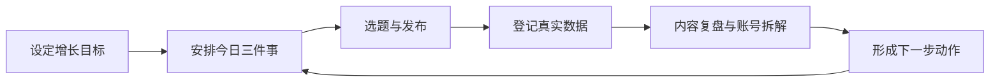

# 自媒体增长驾驶舱

把增长目标、内容生产、数据复盘、Obsidian 资产和本机 AI 放进同一个工作界面。

这是一个面向自媒体创作者的本地应用。它不替你创作，也不托管你的内容，而是帮助你每天看清三件事：目标还差多少、今天应该做什么、哪些动作真正带来了增长。

> 当前版本适合 macOS 上的个人创作者本地使用。程序源码可以公开获取，你的账号数据、内容原文、复盘和 AI 会话都保留在自己的电脑上。

## 它解决什么问题

很多创作者同时使用平台后台、表格、Obsidian、待办工具和多个 AI，但这些信息彼此断开：

- 涨粉目标写在一个地方，今天的动作写在另一个地方。
- 选题、发布记录和复盘没有形成连续流程。
- 文章和视频发了很多，却不知道哪些动作真正有效。
- Obsidian 里积累了大量内容，但每天做决策时很难调用。
- Codex、Claude Code、Kimi、Antigravity 等本机 AI 各自在终端里工作，无法自然接入内容流程。

自媒体增长驾驶舱把这些信息连接成一条可执行的闭环：



## 你可以用它做什么

### 1. 增长总览

集中查看净增粉目标、六平台粉丝、文章与视频等行动目标，以及今天最重要的三件事。

粉丝进度按“当前总粉丝减去启动基线”计算，不会把过去积累的粉丝误算成当前项目成果。

### 2. 内容工作台

用 `选题 → 发布 → 复盘` 管理内容。可以在网页中新增选题、登记制作完成、补充发布证据、归档或恢复内容。

只有具备发布时间和核验证据的发布记录才会进入行动统计，手动修改状态不会虚增完成数。

### 3. 复盘与对标

创建单条内容复盘或账号拆解，记录核心发现和下一步动作。待确认结论需要人工确认后才能成为正式记录。

### 4. 每日复盘

从当天整体创作和增长结果出发，记录事实、有效动作、问题、判断，以及明天最重要的动作。

### 5. AI 协作

在网页中与本机已安装的 AI CLI 持续对话。当前可检测 Codex、Claude Code、Kimi Code、Antigravity 和 Grok Build。

AI 可以读取你主动选择的资料并协助分析，但结果不会自动进入 Obsidian。只有经过接受和再次确认，内容才会写入项目工作区。

### 6. 资产检索

从驾驶舱中查找 Obsidian 里的内容、知识、复盘和项目资产，并直接打开对应原文。

## 数据如何流动

Obsidian 是内容和项目数据的权威来源，驾驶舱是操作与决策界面。

- 在驾驶舱中新建选题、任务或复盘，会保存为 Obsidian Markdown 文件。
- 在 Obsidian 中修改受支持的文件，驾驶舱会自动刷新相应内容。
- 写入使用冲突检测和备份机制，不会静默覆盖同时发生的修改。
- 本地索引、备份、审计记录和 AI 会话默认保存在独立状态目录。
- `.env`、本地配置、Vault 内容和运行数据不会提交到 Git。

## 安装前准备

- macOS
- [Git](https://git-scm.com/)
- [Node.js](https://nodejs.org/) 24.14.0
- npm 11.9.0
- 一个新的或已按本项目结构准备好的 Obsidian Vault
- 可选：已经安装并登录的本机 AI CLI

推荐使用 `nvm` 管理 Node.js。仓库中的 `.nvmrc` 已固定所需版本。

## 安装与启动

### 第一步：下载项目

```bash
git clone https://github.com/duyi2076/media-growth-cockpit.git
cd media-growth-cockpit
```

### 第二步：安装 Node.js 与依赖

```bash
nvm install
nvm use
npm ci
```

### 第三步：创建本地配置

```bash
cp .env.example .env
cp setup.example.json setup.local.json
```

编辑 `.env`：

```dotenv
V2_VAULT_ROOT=/你的绝对路径/自媒体第二大脑
COCKPIT_STATE_ROOT=/你的绝对路径/自媒体驾驶舱状态
```

编辑 `setup.local.json`，填写：

- 产品名称和使用者名称
- 创作定位与增长计划
- 净增粉目标和计划日期
- Obsidian 项目目录
- 平台账号、粉丝基线和当前粉丝
- 文章、视频、发布、复盘、账号拆解的行动目标

请使用自己的真实信息替换示例值。`setup.local.json` 和 `.env` 已被 Git 忽略，不会进入仓库。

### 第四步：初始化独立 Vault

```bash
npm run setup:vault -- --config ./setup.local.json
npm run index
npm run validate:data
```

初始化采用“只创建、不覆盖”策略。如果目标文件已经存在，程序会停止并提示，不会直接覆盖原资料。

### 第五步：启动驾驶舱

```bash
npm run dev -- --host 127.0.0.1 --port 4173 --strictPort
```

浏览器打开：

```text
http://127.0.0.1:4173/
```

## 第一次使用建议

1. 在右上角设置中确认创作定位、增长目标和日期。
2. 在增长总览中核对平台账号与粉丝基线。
3. 设置文章、视频、发布、复盘和账号拆解的目标数量。
4. 确认无误后正式开始统计。
5. 新增今天最重要的三件事。
6. 在内容工作台建立第一个真实选题并走完一次发布与复盘。
7. 最后再连接本机 AI，不要把 AI 安装作为使用驾驶舱的前置条件。

## 让 AI 帮你安装

可以把仓库链接和下面这段话一起发给你电脑上的 AI：

```text
请阅读这个仓库的 README，并在我的 macOS 电脑上协助安装：
https://github.com/duyi2076/media-growth-cockpit

要求：
1. 先检查 Git、nvm、Node.js 和 npm 环境，不要盲目升级其他系统工具。
2. 使用一个全新的 Obsidian 测试 Vault，不连接或修改我现有的重要资料库。
3. 根据我的创作定位、增长目标和平台账号，协助填写 .env 与 setup.local.json。
4. 依次完成 npm ci、setup:vault、index、validate:data 和测试。
5. 启动在 127.0.0.1:4173，并把浏览器地址告诉我。
6. 不要提交 .env、setup.local.json、Vault 内容、账号数据或本机绝对路径。
7. 遇到失败先说明原因，不要删除或覆盖现有文件。
```

## 当前使用边界

- 当前是本地单用户版本，不支持账号登录、多人协作或云端托管。
- 平台粉丝和发布证据需要人工登记，暂不自动抓取各平台后台数据。
- AI CLI 是否可用取决于本机是否安装、登录及版本是否兼容。
- 本机 AI 仍以当前电脑用户权限运行；不要向不可信模型提供敏感资料。
- 建议先用独立测试 Vault 完成一次完整流程，再考虑接入长期使用的知识库。

## 验证项目

```bash
npm run typecheck
npm test
npm run test:server
npm run test:indexer
npm run build
npm audit --audit-level=high
```

GitHub Actions 会在每次提交时执行初始化、索引校验、类型检查、前后端测试、生产构建和依赖审计。

## 更多文档

- [迁移说明](./MIGRATION.md)
- [产品路线图](./ROADMAP.md)
- [AI 协作边界](./docs/V0.4-AI-COLLABORATION.md)
- [AI 任务闭环](./docs/V0.5-AI-TASK-LOOP.md)
- [长期 AI 会话设计](./docs/V0.6-INTERACTIVE-AI-WORKBENCH.md)
- [本机 AI 环境管理](./docs/V0.6.1-AI-ENVIRONMENT-CENTER.md)

## 反馈

如果你在安装或真实使用中遇到问题，请在 GitHub Issues 中说明：

- 使用的 macOS、Node.js 和 npm 版本
- 执行到哪一步失败
- 完整错误信息（先移除账号、路径、Token 和个人内容）
- 问题能否稳定复现
