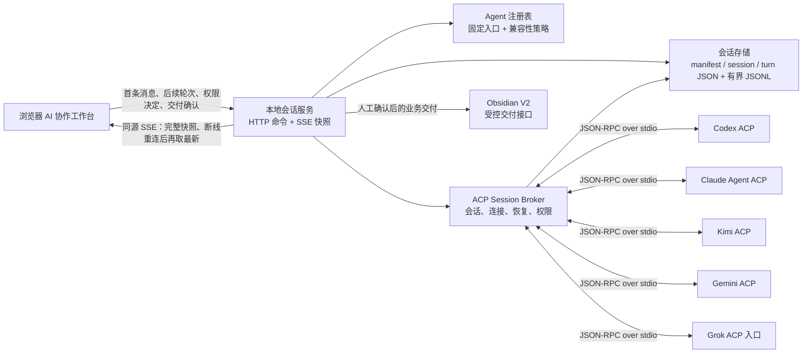
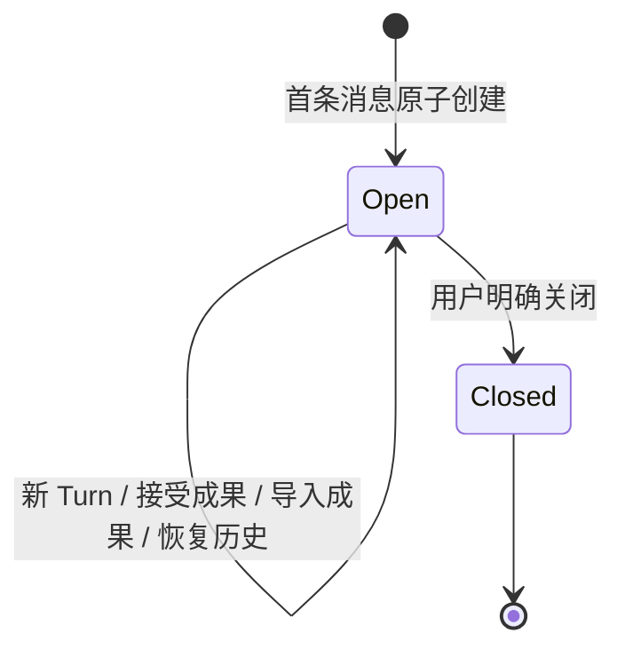
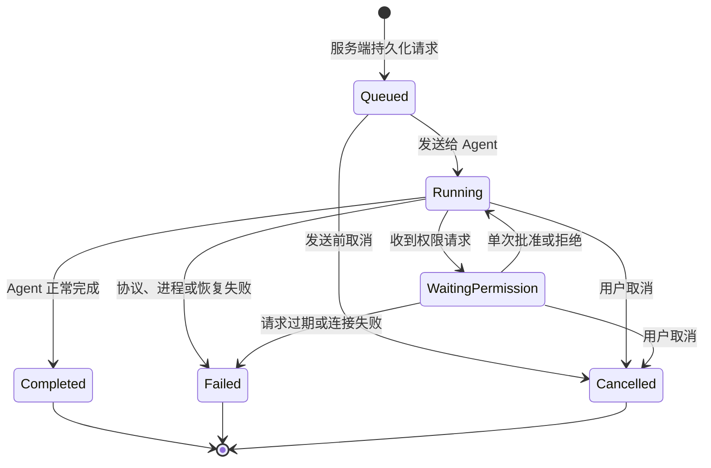
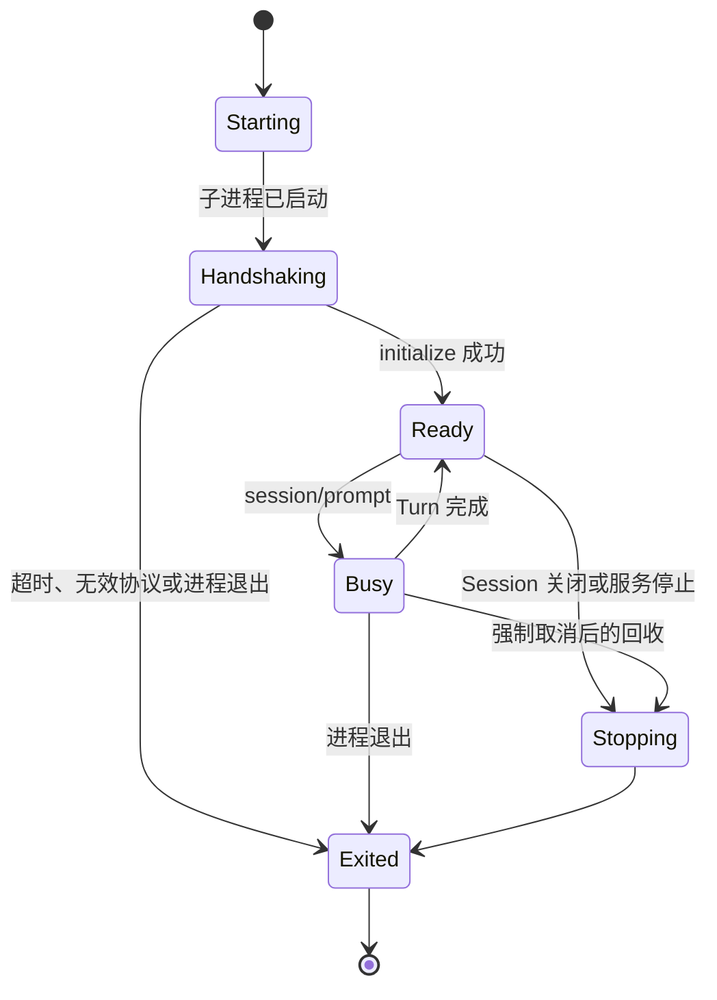
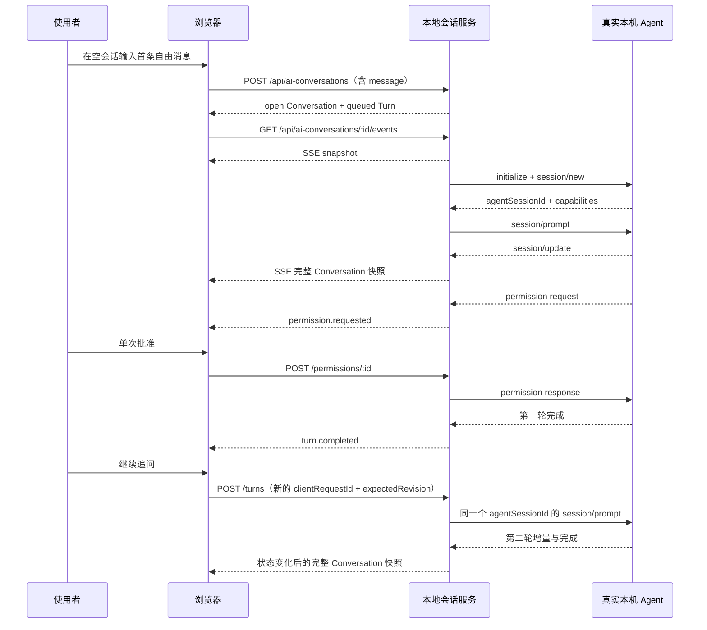

# V0.6 交互式 AI 协作工作台

## 文档地位

本文件是 V0.6 的产品与技术权威合同。实现、测试、页面文案和发布判断均以此为准。

V0.6 继承 V0.4 的本机 Agent 安全边界和 V0.5 的人工交付闭环，但把“一次任务、一次回复”的运行对象升级为“一个长期会话、多轮协作、可恢复”。如本文件与 V0.4/V0.5 在会话模型、事件传输或接口命名上冲突，以本文件为准；V0.5 已经确立的来源校验、预览确认和 Obsidian 受控写回继续有效。

产品版本沿用当前仓库的连续版本号，因此本阶段命名为 V0.6，不跳号命名为 V3 或 V4。

## 用户问题

创作者已经在本机安装并登录 Codex、Claude Code、Kimi Code、Gemini CLI 或 Grok 等工具，但真实工作仍被分散在多个终端窗口里：

- 需要反复复制选题、文章、复盘和今日任务上下文。
- 一次回答结束后，下一轮修改很难回到同一段 Agent 上下文。
- 页面刷新、进程异常或服务重启后，不清楚任务是否仍在运行、是否可以继续。
- Agent 的计划、工具调用、权限请求和最终结果混在终端文本里，无法形成稳定的产品交互。
- CLI 已安装、产品已验证和上游已发布的版本经常被混为一谈，容易产生“已经是最新版，因此一定兼容”的错误承诺。
- AI 结果即使可用，也还要手工搬运到内容、复盘、任务或 Obsidian，来源关系容易丢失。

V0.6 解决的是：

> 在驾驶舱里使用真实的本机 AI CLI，围绕一项创作任务持续多轮协作，并在权限可控、过程可恢复、版本信息诚实、结果可追溯的前提下完成交付。

## 产品定义

V0.6 是像 Claudian 一样可以长期使用的 AI 协作界面，也是本机真实 AI CLI 的结构化前端；它不是网页终端，也不是必须先选择任务模板才能启动的一次性任务器。

使用者打开空会话后，可以直接在底部输入第一条自由消息。发送这条消息时，系统原子创建 Conversation、Agent Session 和第一个 Turn。任务、选题、文章或复盘都是可选的 Context Chip（上下文标签），没有关联资产也可以开始对话。模板只作为输入框里的快捷指令，负责预填文字，不是创建会话的前置条件。

Conversation 默认长期保持 `open`。一轮回复结束后可以继续追问、修改或换一个方向；确认或导入某一轮成果只记录该轮的业务结果，不会自动关闭 Conversation。只有用户明确点击关闭，Conversation 才进入 `closed`。

页面负责呈现：

- 可用 Agent 及其真实状态。
- 长期会话历史、恢复入口、可选上下文和多轮消息。
- Agent 计划、回复、工具调用、权限请求、错误和恢复状态。
- 结果预览、人工确认和业务交付。

本地会话服务负责：

- 从固定注册表启动已允许的 CLI 或 ACP 适配器。
- 维护 CLI 进程、ACP 连接、Agent Session 和浏览器订阅之间的生命周期。
- 把不同 Agent 的协议事件归一化为统一的产品事件。
- 保存会话、轮次、权限、事件序号和交付关系。
- 在浏览器刷新、短时断线或 CLI 进程退出后执行可证明的恢复。

页面不提供：

- shell 提示符。
- 任意命令输入。
- 自定义可执行文件、启动参数或环境变量。
- 原始 JSON-RPC、stdout、stderr 或本机绝对路径。
- “自动使用最新版本”的承诺。

## 成功标准

V0.6 只有同时满足以下条件才算完成：

1. 不选择模板、不关联资产时，首条自由消息也能创建 Conversation，并在同一个 Agent Session 中连续完成至少三轮对话。
2. 浏览器在回复流式生成期间刷新，回复不会因为页面刷新而被终止，重新进入后能够恢复到权威状态。
3. 一次真实权限请求能够被页面明确批准或拒绝；刷新页面后待处理权限仍然存在。
4. CLI 进程异常退出后，支持恢复的 Agent 可以通过 Session ID 恢复；不支持恢复时明确告知，绝不通过自动重放用户指令伪造恢复。
5. Agent 注册表分别保存本机安装版本、产品已验证版本和上游最新版；聊天页只把完成可用性探测的 Agent 放入选择器，不用“可安装”冒充“已通过长期会话认证”。
6. AI 结果未经人工确认不写入 Obsidian，也不增加文章、视频、发布、复盘或账号拆解完成数；确认或导入一轮结果不会关闭 Conversation。
7. Conversation 可从历史中恢复并继续，多轮消息、已接受轮次、最近一次导入字段和本地导入审计均可追溯。
8. 页面只显示业务状态和用户动作，不显示实现过程、调试字段和本机路径。

## 核心业务流程

```text
打开空会话并选择一个可用 Agent
        ↓
可选：添加今日任务或资产 Context Chip
        ↓
在固定输入框发送首条自由消息
        ↓
服务端原子创建 Conversation、Agent Session 和第一个 Turn
        ↓
启动固定 ACP 入口并创建 Agent Session
        ↓
发送第一轮指令，流式展示回复、计划与工具调用
        ↓
遇到敏感动作时等待人工批准或拒绝
        ↓
在同一 Agent Session 中继续追问、修订和确认
        ↓
可选：接受某一轮结果
        ↓
再次确认后写入 Obsidian 的 AI 协作结果，会话保持打开
```

## 总体架构



### 两层协议边界

浏览器与本地会话服务之间使用 HTTP 命令 + 同源 SSE 事件；本地会话服务与 Agent 之间使用 ACP。

这两层不能直接透传：

- 浏览器不能发送任意 ACP 方法。
- 浏览器不能看到 Provider Session ID、进程 ID、可执行文件路径或原始工具参数中的敏感字段。
- 服务端把 ACP 的 `session/update`、工具调用、权限和错误转换成稳定的内部事件。
- 浏览器的 SSE 断线重连不等于 ACP 连接重启。
- ACP 的版本变化只影响服务端适配层，不直接污染页面数据契约。

浏览器事件沿用现有同源 SSE，不再依赖四秒轮询或定时整页刷新。HTTP 写入成功后由服务端立即发出新快照；SSE 持续连接断开时，由浏览器原生重连和服务端最新权威快照恢复。P0 不引入新的双向实时传输层。

### ACP 传输选择

P0 使用 ACP 官方稳定实现支持的 JSON-RPC over stdio。ACP 主分支中的远程流式传输提案不作为 V0.6 的生产依赖。

服务启动时执行 `initialize` 并记录实际协商出的协议版本和能力。不能因为某个适配器依赖了较新的 SDK，就推断所有 Agent 都支持同一组方法。

## 对象与标识语义

V0.6 必须区分四个对象，不能继续用一个 `runId` 表达所有生命周期。

| 对象 | 所有者 | 是否持久化 | 含义 |
|---|---|---:|---|
| Conversation | 驾驶舱 | 是 | 用户看到的一段长期协作记录，可包含多轮 Turn |
| Session | Agent Provider | 是 | Agent 自己维护上下文的会话，由 `agentSessionId` 标识 |
| Turn | 驾驶舱 | 是 | 一次用户输入及其对应的完整 Agent 响应周期 |
| Connection | 本地会话服务 | 否，只留审计摘要 | 一次正在运行的 Broker 与 CLI 进程连接 |

关系如下：

```text
Conversation 1 ── N Turn
Conversation 1 ── N Session（P0 同时只能有一个 active Session）
Session      1 ── N Connection（进程重启后 generation 增加）
Turn         1 ── N Message / ToolCall / PermissionRequest / Event
```

### Conversation

```ts
type AiConversation = {
  id: string
  provider: "codex" | "claude" | "kimi" | "gemini" | "grok"
  templateId:
    | "collaborate"
    | "analyze-topic"
    | "break-down-content"
    | "draft-article"
    | "draft-video"
    | "review-content"
    | "analyze-account"
    | "review-day"
    | "plan-tomorrow"
  context: {
    type: "topic" | "content" | "content-review" | "account-breakdown" | "daily-review"
    id: string
    title: string
    summary?: string
  } | null
  status: "open" | "closed"
  sourceTask: {
    id: string
    date: string
    title: string
    linkType: string
    linkId: string
  } | null
  permissionMode: "readonly" | "ask"
  runtime?: {
    providerVersion: string | null
    adapterPackage: string | null
    adapterVersion: string | null
    protocolVersion: number | null
    versionStatus: "current" | "outdated" | "newer" | "unknown"
  }
  revision: number
  activeTurnId: string | null
  acceptedTurnId: string | null
  acceptedAt: string | null
  importedAt: string | null
  importedRelativePath: string | null
  importedTurnId: string | null
  turns: AiTurn[]
  pendingPermission: AiPermissionRequest | null
  createdAt: string
  updatedAt: string
}
```

这是页面与 API 共享的固定 DTO。Conversation 的业务状态只有 `open | closed`；运行中、等待权限和失败属于 Turn，不得再次塞回 Conversation 状态。

`context` 可以为 `null`。页面只提交资产类型和 ID，标题来自服务端权威索引；来源路径、正文和指纹保存在服务端内部记录中，不进入公开 DTO。自由消息使用后台默认模板 `collaborate`；它不要求用户先选择模板，也不在空态占据主操作位置。

`revision` 是 Conversation 的乐观并发版本。需要乐观锁的修改请求携带 `expectedRevision`；服务端状态已经变化时返回 `409 Conflict`，页面随即重新读取并应用最新权威快照，禁止静默覆盖。

`activeTurnId` 指向当前 `queued | running | waiting_permission` 的 Turn；没有活动 Turn 时为 `null`。`acceptedTurnId` 只表示用户当前选中的可交付成果轮次，不会改变 Turn 状态，也不会关闭 Conversation。P0 公开 DTO 只保留最近一次成功导入的 `importedAt / importedRelativePath / importedTurnId`；完整导入审计保存在本地状态根的追加日志中，不承诺公开 `importReceipts[]`。

### Session

```ts
type AiSession = {
  id: string
  conversationId: string
  provider: AiConversation["provider"]
  status: "starting" | "ready" | "active" | "disconnected" | "resuming" | "unrecoverable" | "closed"
  agentSessionId: string
  protocolVersion: string
  capabilities: AiSessionCapabilities
  adapterVersion: string
  cliVersion: string
  model: string | null
  connectionGeneration: number
  resumeStrategy: "resume" | "load" | "none"
  createdAt: string
  lastActiveAt: string
  closedAt: string | null
}
```

`agentSessionId`、连接代数和恢复策略只在服务端保存。页面只收到可继续、正在恢复、无法恢复等产品状态。

### Turn

```ts
type AiTurn = {
  id: string
  seq: number
  clientRequestId: string
  userText: string
  status:
    | "queued"
    | "running"
    | "waiting_permission"
    | "completed"
    | "failed"
    | "cancelled"
  assistantText: string
  outputSha256: string | null
  stopReason: string | null
  error: string | null
  events: AiTurnEvent[]
  createdAt: string
  startedAt: string | null
  completedAt: string | null
}
```

`clientRequestId` 由页面在发送每条消息前生成。首条消息的 ID 在创建请求之间全局唯一，后续消息的 ID 在同一 Conversation 内唯一。网络重试时必须复用原值；服务端返回同一 Conversation 或 Turn，不能再次向 Agent 发送同一条指令。同一个 ID 携带不同创建参数或正文时返回冲突。

进程退出且无法确认是否送达时，Turn 进入 `failed`，并使用稳定错误码表达“执行结果不确定”；不增加其他公开状态。恢复动作发生在 Session 层，新指令始终创建新的 Turn。

### TurnEvent 与 PermissionRequest

```ts
type AiTurnEvent = {
  id: string
  seq: number
  type: "status" | "message" | "thought" | "plan" | "tool_call" | "tool_update" | "diff" | "permission" | "error" | "completed"
  text?: string
  title?: string
  status?: string
  toolCallId?: string
  details?: Record<string, unknown>
  createdAt: string
}

type AiPermissionRequest = {
  id: string
  turnId: string
  toolCallId: string
  title: string
  kind?: string
  options: Array<{
    optionId: string
    name: string
    kind: "allow_once" | "reject_once"
  }>
  createdAt: string
  expiresAt: string
}

```

P0 只允许单次批准或单次拒绝。永久批准、自动批准和 Provider 返回的高风险长期授权选项均被服务端过滤。

## 权威状态机

### Conversation 状态



规则：

- 一个 `open` Conversation 同一时间只能有一个活动 Turn。
- 接受成果更新 `acceptedTurnId / acceptedAt`，导入成果更新最近一次导入字段与审计日志；两者都会增加 `revision`，Conversation 仍为 `open`。
- 页面刷新只移除 SSE 订阅者，不改变 Conversation、Session、Turn 或 CLI 进程状态。
- `closed` 后不接受新 Turn；历史记录、接受记录、最近一次导入字段和审计记录保持只读。

### Turn 状态



`waiting_permission` 是服务端权威状态，不是页面弹窗的临时状态。Turn 到达终态后，`activeTurnId` 清空；用户可以继续发送下一轮。

### Connection 状态



Connection 是进程级状态，不能覆盖 Conversation 的持久状态。每次重新启动 CLI 都创建新的 `connectionId` 并增加 `connectionGeneration`。

### 一次多轮交互



## SSE 快照合同

浏览器不能接收原始 ACP 消息。服务端先把 ACP 更新归一化并持久化到固定 Conversation DTO，再通过 SSE 发送这份完整快照。

```text
id: {revision}:{eventCount}
event: conversation
data: {"id":"conv-...","status":"open","revision":8,"activeTurnId":"turn-...","turns":[]}
```

规则：

- `revision` 在 Conversation 每次权威变更后递增，是页面判断新旧快照和 HTTP 乐观并发的依据。
- Turn 内部事件使用连续 `seq` 保存；页面不直接接收原始 JSON-RPC 或 stdout。
- 服务端先持久化 Conversation，再发送 `event: conversation`。
- 首次订阅立即发送当前完整快照，不等待下一次变化。
- `EventSource` 断线后自动重连；重连成功后服务端再次发送最新完整快照，因此不需要页面按四秒轮询，也不依赖增量事件补发才能恢复正确状态。
- 相同 `revision:eventCount` 的快照不重复发送；页面收到较旧 Revision 时忽略。
- SSE 只负责服务端到页面的状态变化；发送消息、取消、权限、接受、导入和关闭全部走 HTTP。

## HTTP 与 SSE 接口

### Agent 与版本

#### `GET /api/ai-agents`

返回固定 Provider 注册表、安装状态、握手状态、能力快照和三层版本信息。

```ts
type AiAgentStatus = {
  provider: "codex" | "claude" | "kimi" | "gemini" | "grok"
  displayName: string
  availability: "available" | "missing" | "login_required" | "unhealthy" | "experimental"
  installed: {
    version: string | null
    checkedAt: string
  }
  verified: {
    version: string | null
    adapterVersion: string | null
    testedAt: string | null
  }
  upstream: {
    latestVersion: string | null
    sourceUrl: string | null
    checkedAt: string | null
    stale: boolean
  }
  compatibility: "compatible" | "update_available" | "unverified" | "missing" | "blocked"
  capabilities: AiSessionCapabilities | null
  reasonCode: string | null
}
```

该接口不能因上游版本查询失败而把一个已经验证可用的本机 Agent 判定为不可用。

### Conversation

#### `POST /api/ai-conversations`

```json
{
  "provider": "codex",
  "templateId": "collaborate",
  "context": null,
  "permissionMode": "readonly",
  "clientRequestId": "01J3CREATECONVERSATION",
  "message": "帮我判断下一条 AI 应用短视频应该讲什么。"
}
```

这是空会话底部自由输入的主入口。服务端原子创建 `open` Conversation、Session 和第一个 `queued` Turn；页面不需要先调用一个“创建空任务”接口。

`context` 可以为 `null`。自由消息由页面在后台提交默认 `templateId: "collaborate"`；选择其他模板时，页面先把模板展开成可编辑文字，再记录模板 ID。选择 Context Chip 时，`context` 只包含服务端索引中的资产类型和 ID。服务端重新解析资产标题、正文和指纹。

从今日任务进入时可以额外提交 `sourceTaskId`。请求不能包含命令、参数、环境变量、工作目录、原文路径、Provider Session ID 或协议版本。创建响应不确定时，页面只能携带原 `clientRequestId` 和字节等价的业务参数重试；服务端返回原 Conversation，不能新建第二个会话或再次执行首轮。

#### `GET /api/ai-conversations`

按更新时间倒序返回 Conversation 列表。P0 沿用固定 DTO；数量和单会话大小都受服务端上限保护，后续只有出现真实性能证据时才增加分页。

#### `GET /api/ai-conversations/:conversationId`

返回固定 Conversation DTO。活动 Session、连接和恢复细节只以安全摘要表达，不能向页面增加另一套 Conversation 运行状态。

#### `POST /api/ai-conversations/:conversationId/turns`

```json
{
  "message": "把第二段改得更适合口播，但不要改变事实。",
  "clientRequestId": "01J3CLIENTREQUEST",
  "expectedRevision": 7
}
```

限制：

- Conversation 必须为 `open`，并且 `activeTurnId` 为 `null`。
- 同一 `clientRequestId` 和同一消息重复提交返回原 Turn；同一个 ID 携带不同消息时返回冲突。
- 文本和总载荷均有上限。后续 Turn 继续使用创建时已经固定的可选 Context，不接受临时文件路径。
- 服务端在向 Agent 发送前持久化 `queued` Turn；发送结果不确定时标记 `failed` 并返回稳定错误码，不自动重放。

#### `POST /api/ai-conversations/:conversationId/turns/:turnId/cancel`

请求体为空。Turn ID 必须属于当前 Conversation，且只能取消当前活动 Turn。

当前实现先把 Turn 权威状态收敛为 `cancelled`，再发送 ACP `session/cancel` 并等待当前 prompt 结束；它不会因为取消单轮就强制结束仍可复用的长期 Connection。只有显式关闭 Conversation 或本地会话服务退出时，才按 `SIGTERM → 有限等待 → SIGKILL` 回收本产品启动的进程组。取消请求幂等。

#### `POST /api/ai-conversations/:conversationId/turns/:turnId/permissions/:requestId`

```json
{
  "optionId": "allow-once"
}
```

服务端同时校验 Conversation、活动 Turn、Request ID、待处理状态和过期时间。权限解决后 `pendingPermission` 清空；旧页面的迟到响应不能批准新的工具调用。

#### `POST /api/ai-conversations/:conversationId/close`

请求体为空。只有没有活动 Turn 时才能关闭；服务端处理待决权限、回收 Connection，并把 Conversation 从 `open` 改为 `closed`。重复关闭保持幂等。

#### `POST /api/ai-conversations/:conversationId/accept`

```json
{
  "turnId": "turn-01J3...",
  "outputSha256": "0123456789abcdef0123456789abcdef0123456789abcdef0123456789abcdef",
  "expectedRevision": 14
}
```

只允许接受 `completed` Turn，并复核 `outputSha256`，避免页面接受已经变化的输出。成功后更新 `acceptedTurnId`、`acceptedAt` 和 `revision`，不改变 Turn 的 `completed` 状态，也不关闭 Conversation。之后继续追问时，可以接受新的 Turn；旧导入仍可从本地追加审计追溯，但公开 DTO 只显示最近一次导入字段。

### 业务交付

#### `POST /api/ai-conversations/:conversationId/import`

请求体为空。当前 `acceptedTurnId` 必须指向 `completed` Turn，服务端复核接受时保存的输出哈希。导入正文只能来源于该 Turn 的权威 `assistantText`；浏览器不能替换 AI 最终文本、指定任意 Vault 路径或覆盖已有资产。点击导入前不修改 Vault。

写入成功后更新最近一次导入字段，并向状态根追加不含正文的审计记录；Conversation 继续保持 `open`，固定输入框仍可继续发送消息。导入不是完成或关闭会话的快捷方式。

### `GET /api/ai-conversations/:conversationId/events`

该接口返回同源 `text/event-stream`。首次连接立即发送权威 Conversation 快照：

```text
id: 8:19
event: conversation
data: {"id":"conv-...","status":"open","revision":8,"activeTurnId":"turn-...","turns":[]}
```

每个正在查看的 Conversation 建立一条 SSE。状态变化时服务端发送新的完整快照；断线重连后再次发送最新快照。定期注释心跳只保持中间连接存活，不触发数据重算，也不刷新页面。

关闭浏览器标签页只关闭 SSE 订阅，不关闭 Agent Session。SSE 失败不会降级成四秒或六十秒轮询；页面保留当前快照并显示“正在重新连接”。

## Agent 注册表与能力协商

服务端只允许以下固定 Provider。页面不能新增 Provider、修改命令或提交参数。

| Provider | 固定入口 | 当前 V0.6 证据边界 | 标记规则 |
|---|---|---|---|
| Codex | `@agentclientprotocol/codex-acp` | 仓库提供独立真实三轮脚本，验证服务重启后的 Session 恢复、人工导入边界和进程回收 | 脚本实际通过的本机版本才标记 V0.6 已验证 |
| Claude Code | `@agentclientprotocol/claude-agent-acp` | 已有安装、版本和最小握手检测；尚未由 V0.6 三轮脚本认证 | 显示检测状态，不宣称 V0.6 已验证 |
| Kimi Code | `kimi acp` | 已有安装、版本和最小握手检测；部分可选 Session 方法可能不支持 | 显示检测状态，不宣称 V0.6 已验证 |
| Gemini CLI | `gemini --acp` | 认证必须在 MCP 和 Session 初始化前成功；当前认证状态按实时探测展示 | 未通过 V0.6 专项测试前不宣称已验证 |
| Grok | `grok agent stdio` | 公开协议与适配器证据弱于其他四个 Provider，不能只凭命令存在宣称完整支持 | 未通过同套真实端到端测试前标记实验性或未验证 |

每次建立 Connection 都必须执行能力协商，至少记录：

```ts
type AiSessionCapabilities = {
  sessionNew: boolean
  sessionResume: boolean
  sessionLoad: boolean
  sessionCancel: boolean
  sessionClose: boolean
  permissions: boolean
  toolCalls: boolean
  plans: boolean
  images: boolean
  terminal: boolean
  mcp: boolean
}
```

页面只显示能力支持的控件。缺少 `sessionResume`、`sessionLoad`、`sessionClose`、终端或 MCP 不得当作协议错误，也不能伪造对应能力。

P0 不在网页展示或开放 Agent 的终端能力。能力字段只用于兼容性判断和未来扩展。

## 版本策略

### 三种版本必须分开

| 名称 | 含义 | 来源 | 能否证明兼容 |
|---|---|---|---:|
| 本机安装版本 | 当前真正会被启动的 CLI 或适配器版本 | 绝对路径复验后的本机 `--version`、包元数据或协议握手 | 否 |
| 产品已验证版本 | 本产品完成真实端到端测试并写入兼容清单的版本 | 仓库内受审的兼容清单与测试记录 | 是，只对该版本和记录的环境成立 |
| 上游可用最新版 | 上游仓库、包管理器或官方发布源当前公开的最新版本 | 用户触发或受控后台查询，带来源与时间 | 否 |

页面禁止把三者合并成一个“版本”字段。示例：

```text
本机：0.x.y
已验证：0.x.z（验证于 YYYY-MM-DD）
上游最新：0.x.n（检查于 YYYY-MM-DD HH:mm）
状态：可用 / 有更新但未验证 / 本机版本未验证 / 缺失 / 需要登录 / 异常
```

### 运行选择

- 默认启动本机已安装且与兼容清单匹配的版本。
- 本机版本高于或低于已验证版本时，必须执行最小握手和真实冒烟测试；通过前标记“未验证”，不能静默当作可用。
- “上游最新版”只用于提示，不触发自动下载、安装、升级或切换。
- 活动 Session 期间禁止热升级 CLI 或适配器。
- 升级后必须重启对应 Connection，重新执行协议握手和 Agent 专项验收。
- Codex CLI 与 `codex-acp` 适配器版本分别记录；Claude Code 与其 ACP 适配器同理。
- CLI 版本与模型版本分别处理。产品不能因为 CLI 已更新就宣称正在使用某个“最新模型”。
- 上游查询失败或离线时保留上次结果并标记 `stale`，不能伪造最新版。

### 升级后的最小回归

每个 Provider 升级后至少完成：

```text
版本发现
  → initialize
  → session/new
  → 连续三轮 session/prompt
  → 一次真实或受控权限请求
  → cancel
  → 进程退出后的 resume/load 或诚实降级
  → 浏览器刷新重连
  → 人工交付预览
```

未通过的版本不能进入“已验证版本”清单。

## 会话持久化与恢复

### 本地存储

```text
{COCKPIT_STATE_ROOT}/ai-conversations/{conversation_id}/
├── manifest.json
├── session.json
├── workspace/                 # Agent 唯一工作目录
│   └── inputs/
│       └── {服务端校验并复制的权威原文}
├── turns/
│   └── {turn_id}.json
└── events/
    └── {turn_id}.jsonl
```

- `manifest.json` 保存 Conversation、Revision、活动 Turn、接受状态、最近一次导入状态与来源副本清单。
- `session.json` 保存服务端私有的 Provider Session 与实际能力证据，不进入公开 DTO。
- `turns/*.json` 与有界 `events/*.jsonl` 共同构成消息和结构化事件的权威记录；V0.6 不使用 SQLite，也不复用 V0.4 Run 的查询库。
- `manifest/session/turns/events` 位于 Agent 工作目录之外；Agent 的固定 `cwd` 只能是 `workspace/`，不能直接改写权威会话控制文件。
- `workspace/inputs` 在创建时复验原文哈希并以只读权限保存；每轮开始前再次核对文件集合、大小与哈希。当前仍是同一 macOS 用户下的应用级隔离，不等同于操作系统沙箱。
- 工作空间位于固定状态根，不能把 Vault、仓库根、CLI 配置目录或用户主目录作为 Agent 工作目录。
- stdout 的 ACP 消息默认不原样写日志；stderr 经过脱敏和大小限制后只保留必要诊断摘要。

### 浏览器刷新或短时断线

1. CLI 进程和 Agent Session 继续运行。
2. 页面重新建立同源 SSE。
3. 服务端立即返回包含最新 `revision` 的完整权威快照。
4. 页面恢复流式状态、待决权限和取消按钮。

### CLI 进程异常退出

1. 当前 Turn 标记 `failed` 并记录“执行结果不确定”错误码；Conversation 仍为 `open`，`activeTurnId` 清空。
2. 所有属于旧 Connection 的待决权限标记 `cancelled`。
3. 启动新的固定入口并重新 `initialize`。
4. 当前实现只在 Provider 明确声明能力时使用 `session/resume`；尚未实现 `session/load`，不能用它承诺恢复。
5. 恢复成功后创建新的 Connection Generation，Conversation 保持 `open`，允许发送新的 Turn。
6. 恢复失败时保留页面记录和 `open` Conversation，标记“历史可见，但 Agent 上下文已中断”，由用户显式创建新 Session 后继续。

禁止把历史 Prompt 自动重新发送给新 Session。自动重放可能重复写文件、联网、发布或产生其他副作用，也不能证明 Provider 恢复了原始隐藏上下文。

### 本地会话服务重启

- 启动时扫描未终结 Conversation 和 Session。
- 如果子进程已随服务退出，按相同恢复规则重新连接。
- 服务崩溃时尚未确认是否送达 Agent 的 Turn 标记 `failed` 并使用“执行结果不确定”错误码，由用户选择重新发送为一个新的 Turn。
- 服务重启不得自动批准权限、自动交付结果或自动重放指令。

### 显示记录与 Agent 上下文

页面消息记录与 Agent 自己的 Session 上下文是两套不同的权威边界：

- 页面记录用于显示、审计、搜索和交付选择。
- Agent Session 决定下一轮真实可见的上下文。

页面能够显示历史消息，不代表新的 Agent Session 已经拥有这些上下文。无法恢复时必须明确提示“历史可见，但 Agent 上下文已中断”。

## 权限模型

### 默认策略

- 默认采用最小权限模式。
- Agent 只在独立工作空间中运行，不直接把整个 Vault 作为工作目录。
- 读取驾驶舱资产时，由服务端通过资产 ID 解析并复制经过白名单校验的材料。
- 浏览器不能扩大 Agent 可访问的根目录。
- P0 只开放单次允许和单次拒绝。
- 如果 Provider 无法通过 ACP 上报权限请求，产品不能把它标为“可写任务可用”；只能进入受限只读模式或不可用状态。

### 权限请求生命周期

```text
Agent 发出权限请求
        ↓
服务端持久化 pending 请求并广播事件
        ↓
页面显示动作、范围、风险和单次选项
        ↓
用户批准 / 拒绝 / 取消 Turn / 请求超时
        ↓
服务端校验 requestId + sessionId + turnId + generation
        ↓
只向原始 ACP 请求返回一次结果
```

刷新页面不会清除待决权限。关闭 Conversation、取消 Turn、进程退出或超时都会使请求失效；迟到响应返回 `409 Conflict`。

### 取消

- 取消是显式产品动作，不等于关闭浏览器。
- 取消把当前 Turn 收敛为 `cancelled` 并发送 ACP cancel；不回收仍可复用的长期 Connection，也不会杀掉整个本地服务。
- 取消时所有待决权限同步失效。
- 取消后的部分输出保留并标记“已取消”，不能伪装成完整结果。

## 威胁模型

| 资产或边界 | 主要威胁 | P0 控制 | 剩余风险 |
|---|---|---|---|
| Agent 启动入口 | 页面注入命令、参数或 shell 元字符 | 固定注册表、绝对路径复验、`shell: false`、Prompt 只走协议消息 | 已允许的 CLI 本身仍以本机用户身份运行 |
| 工作目录 | `..`、绝对路径、软链接逃逸 | 固定状态根、真实路径校验、允许根白名单、创建前后复验 | 操作系统级恶意进程仍可能主动访问其他目录 |
| 环境变量与凭证 | 把全部环境变量、Token 或代理配置泄露给 Agent | Provider 级环境变量白名单、日志脱敏、禁止页面提交环境变量 | 官方 CLI 为复用登录可能仍需少量主目录配置 |
| ACP stdout/stderr | 原始内容包含用户文本、文件内容、Token 或协议噪声 | stdout 仅解析不默认原样落盘；stderr 脱敏、截断、限额 | Provider 可能输出无法完整识别的新敏感格式 |
| 权限确认 | 页面绕过、旧请求重放、长期授权误批 | 服务端 pending 状态、请求代数、过期时间、单次选项、默认拒绝 | CLI 未通过 ACP 上报的行为无法由网页弹窗拦截 |
| 浏览器接口 | 其他本机网页伪造请求 | 只绑定 loopback、同源校验、CSRF、本地会话令牌、JSON 与字段白名单 | 同一登录用户下的恶意本机进程仍是信任边界外风险 |
| 多轮消息 | 网络重试造成同一指令执行两次 | `clientRequestId` 唯一约束、先持久化再发送、幂等响应 | 进程崩溃发生在“已发送但未确认”窗口时只能标记不确定 |
| 权限迟到响应 | 旧页面批准新进程中的同名请求 | 校验 Session、Turn、Request ID 和 Connection Generation | Provider 自身错误复用 ID 时仍需适配层拒绝 |
| 事件流 | 丢包、乱序、重复或页面遗漏 | 每次发送完整 Conversation、单调 `revision`、重连后最新快照 | 超长会话的完整快照需要严格大小上限 |
| 子进程 | 僵尸进程、孤儿进程、失控输出 | 进程组跟踪、退出监听、握手超时、输出限额、分级终止 | CLI 内部再派生且脱离进程组的子进程可能需要后续沙箱 |
| 页面刷新 | 刷新误杀任务或丢失权限 | 订阅者与 CLI 生命周期分离、服务端权威状态 | 本地会话服务本身退出时仍需 Session 恢复能力 |
| 进程恢复 | 自动重放造成重复副作用 | 只使用 `resume/load`，失败则显式新建 Session | Provider 不支持持久 Session 时无法无损恢复隐藏上下文 |
| Markdown 与工具输出 | HTML/脚本注入、恶意链接、超大内容 | 语法树渲染、禁原始 HTML 与远程图片、只允许 HTTP(S) 外链、`noopener`、内容大小限制 | 用户主动打开外链仍需自行判断 |
| Obsidian | 未确认写回、覆盖原件、敏感内容进入索引 | 沿用 V0.5 预览确认、固定目录、原子写入、冲突校验、敏感级别过滤 | 本机文件系统与 Obsidian 插件并发修改仍需冲突处理 |
| 版本更新 | 自动升级破坏兼容或替换可信入口 | 不自动升级、兼容清单、真实路径复验、升级后全套回归 | 上游供应链风险不能仅靠版本号消除 |

V0.6 仍不是操作系统沙箱。它适合本人在本机、可见操作下使用，不应开放公网，不应处理不可信脚本，也不能把“有权限弹窗”描述成对失控进程的完整隔离。

## 页面结构

V0.6 增加独立的 `AI 协作` 一级入口。桌面页面由四部分组成：

```text
┌──────────────┬──────────────────────────────────┬────────────────────┐
│ 历史与恢复   │ 长期消息区                       │ 权限 / 交付        │
│ 首条摘要     │ 消息、计划、工具调用、错误       │ 可折叠              │
│ Agent 标识   │ Context Chip + 固定 Composer     │                    │
└──────────────┴──────────────────────────────────┴────────────────────┘
```

页面借鉴 Claudian 的结构关系：长期消息区、始终固定在底部的 Composer（输入框）、Composer 上方的 Context Chip、可恢复的历史会话入口。只借鉴信息结构和交互职责，不复制其 Obsidian 侧栏比例、颜色、字体、图标或具体视觉。

### 会话列表

- 显示首条消息摘要、Agent、最后更新时间、是否有活动 Turn 和恢复状态。
- 不显示 Provider Session ID、运行目录、进程 ID 或协议调试信息。
- P0 支持从历史恢复、继续、关闭和查看最近一次导入结果；完整导入历史只保留本地审计，不支持分支和合并。

### 当前会话

- 用户消息和 Agent 回复按 Turn 分组。
- 计划、工具调用和权限使用结构化卡片，不混成终端日志。
- 空会话直接显示固定 Composer；输入首条自由消息即可创建 Conversation。
- Context Chip 是可选项。没有 Chip 时可以发送；添加后可以在发送前移除。
- 模板入口退居 Composer 的快捷菜单，选中后只预填可编辑文字，不改变权限，也不强制绑定资产。
- 流式文本原位增长，不因服务端事件导致输入框失焦。
- 中文输入法 composition 期间不得提交、刷新组件 Key 或重建输入框。
- 发送后可以继续浏览，只有当前 Turn 结束后才能发送下一轮。
- 取消、重连和重新发送必须是明确按钮。
- Composer 在接受或导入成果后继续保留，Conversation 不出现“已完成即关闭”的终点界面。

### Agent 状态

- 默认只显示“可用、需要登录、未安装、未验证、异常、实验性”等用户可行动状态。
- 版本详情在二级抽屉中分开展示本机、已验证和上游最新。
- 不在主界面展示适配器包名、绝对路径、协议版本或实现说明。

### 权限与交付

- 待处理权限固定在当前会话可见区域，不能只依赖短暂 Toast。
- 权限卡片明确说明 Agent 想做什么、影响范围和单次选项。
- 完成 Turn 后可以先“接受本轮”，再出现业务交付入口；接受动作不写入 Obsidian。
- 写入 Obsidian 前必须显示成果类型、目标资产、来源任务和正文预览。
- 导入成功后显示可打开的回执，同时保留长期消息区和 Composer。

### 响应式边界

- 主要验收视口：1440×900、1280×720、1024×768。
- 1440px 默认三栏；1280px 右栏可折叠；1024px 会话列表和右栏使用抽屉。
- P0 不以手机浏览器作为主要使用方式。

## 与现有驾驶舱的关系

### 今日任务

- “交给 AI”只把该任务预装为可移除的 Context Chip，并打开空 Composer；用户发送首条消息时才创建 Conversation。
- 同一任务可以继续原 Conversation，也可以显式新建一个 Conversation。
- AI 交付不自动勾选今日任务。

### 内容、复盘与对标

- 可以从选题、内容复盘、账号拆解或每日复盘进入 AI 协作，对应资产成为可移除 Context Chip。
- 资产 ID 由页面提交，原文与指纹由服务端解析。
- 多轮修改完成后，先接受具体 Turn，再创建交付预览；接受或导入后仍可继续追问。
- “待人工确认”仍需用户在对应业务页面确认，不能因为 Agent 已完成而自动转为正式资产。

### 行动目标

- AI 对话数量、Token 数量和工具调用次数都不直接增加行动目标。
- 只有符合现有证据规则的已核验发布、已确认每日复盘或已完成账号拆解才计数。

### 旧 V0.4/V0.5 Run

- 现有 `/api/ai-runs` 和历史运行保持只读兼容，不能在迁移时删除。
- V0.6 新会话使用 `/api/ai-conversations`。
- 旧 Run 可在历史区查看并继续使用原交付记录，但不能伪造成可继续的多轮 Session。

## P0 范围

### P0-A：会话平台

1. 空会话底部自由输入首条消息即可原子创建 Conversation；模板和 Context Chip 均可省略。
2. 同一 Agent Session 连续多轮 `session/prompt`。
3. 结构化展示文本、计划、工具调用、权限、错误和取消状态。
4. HTTP 命令与同源 SSE 事件分离，使用持续连接和完整快照恢复。
5. 浏览器刷新不终止 CLI；服务重启和进程退出按能力恢复。
6. `clientRequestId` 幂等，避免后续消息重复执行。
7. 单次权限批准或拒绝，待决状态可跨页面刷新恢复。
8. 长期消息区、固定 Composer、可选 Context Chip、历史恢复和显式关闭。
9. 接受或导入单轮成果不会关闭 Conversation。
10. 可选关联今日任务与现有资产；已接受 Turn 只有再次确认后才进入项目 `03-工作过程/AI协作`。
11. 三层版本与能力矩阵。
12. 本地单用户、loopback、同源和受控工作空间安全边界。

### Provider 专项认证（逐个完成，不作为 P0-A 界面启用的总开关）

1. 固定注册 Codex、Claude Code、Kimi Code、Gemini CLI 和 Grok。
2. 五个 Provider 分别展示安装、版本、登录、握手和能力探测的真实状态。
3. Codex、Claude Code、Kimi Code 和 Gemini CLI 必须分别通过真实多轮、权限、取消、刷新、进程恢复和交付测试，才能标记“V0.6 已验证”。
4. Grok 必须用当前本机真实入口通过同一套测试，才能标记“可用”；仅能启动或仅有版本号不算支持。
5. 缺失、认证受阻、协议不兼容或能力不足时显示真实状态，不用其他 Agent 冒充，不阻塞其余 Provider 使用。

P0-A 可以先供本人内部使用。产品不能因为注册表中固定了五个 Provider，就对外概括为“五种 CLI 均已通过长期会话验证”；必须逐个列出已检测、认证受阻、实验性或已通过专项验收。当前发布证据只覆盖真实 Codex 三轮闭环，其余 Provider 不做等价承诺。

## P1 候选

只有 P0 连续真实使用并出现明确需求后，才进入以下功能：

- 三个以上 Conversation 并行运行，或在同一页面并排操作多个会话。
- Conversation 分支、复制和归档搜索。
- 从一个 Agent 显式交接到另一个 Agent，并保留可审计的上下文包。
- 模型、思考强度和 Provider 配置档选择。
- 图片、文件与更多 ACP Content Block。
- Token、耗时和费用统计。
- 会话级长期授权；仍不得提供全局永久 YOLO。
- 更强的进程沙箱和目录级系统权限。
- 本地全文搜索、会话标签和常用任务模板。
- Provider 版本更新助手；仍需用户确认、重启和真实回归。

新增 P1 功能的证据门槛是：至少连续使用七天、完成二十个真实 Conversation，并记录三次以上同类阻塞。仅因为技术上能实现，不构成新增理由。

## 明确不做

- 网页终端、任意 shell 或用户自定义 CLI 命令。
- Agent 自动安装、自动升级、自动登录、自动切换账号或自动读取凭证。
- 把“上游最新版”自动当作“已验证版本”。
- 多 Agent 自动分工、自动互审、群聊、自治循环或 Agent 互相调用。
- 自动回放历史 Prompt 来伪造 Session 恢复。
- 同一 Conversation 同时执行多个 Turn。
- 让多个 Agent 同时修改同一工作空间。
- 把整个 Vault、代码仓库、用户主目录或 CLI 配置目录开放给 Agent。
- 未经人工确认写入 Obsidian、发布内容、勾选任务或增加行动目标。
- 云端托管、多人账号、远程控制、局域网开放和公网访问。
- 手机端优先设计。
- 把原始协议日志、版本探测过程或实现说明放进默认产品界面。

## 实施顺序

```text
1. 冻结数据模型与事件协议
2. 建立 Conversation / Session / Turn 持久层
3. 抽出 Agent Registry 与统一能力模型
4. 实现 ACP Session Broker 和单 Provider 多轮闭环
5. 实现同源 SSE 持续订阅与完整快照
6. 实现权限、取消、进程退出和恢复
7. 接入任务上下文、接受本轮与通用 AI 协作结果导入
8. 按 Provider 逐个完成专项认证；未通过者保持未验证或实验性
9. 完成桌面页面、可访问性、安全与故障验收
10. 本人连续使用并记录证据
```

每一步必须先完成自动化和真实故障验证，再进入下一步。不能用 Mock 通过替代真实 CLI 通过。

## 发布验收清单

### 数据与接口

- [ ] Conversation、Session、Turn、Connection 使用不同 ID，关系可追溯。
- [ ] Conversation 公开状态只有 `open | closed`；活动状态只由 Turn 的六种固定状态表达。
- [ ] `templateId: "collaborate"` 与 `context: null` 可以创建首条自由消息，不要求先选模板或资产。
- [ ] 首条消息的 `clientRequestId` 在创建请求间全局唯一，后续消息在同一 Conversation 内唯一；重复请求不会重复执行。
- [ ] 每个修改响应都返回新的 `revision`；后续消息和接受成果使用乐观并发校验。
- [ ] 服务端先持久化 Turn 与事件，再广播到页面。
- [ ] SSE 首次连接、状态变化和断线重连都返回最新完整 Conversation 快照。
- [ ] 页面按 `revision` 忽略旧快照，不会重复文本或丢失工具状态。
- [ ] 页面不能提交可执行文件、参数、环境变量、工作目录、绝对路径或 Provider Session ID。
- [ ] 旧 `/api/ai-runs` 历史仍可读，迁移不删除既有记录。

### 多轮与生命周期

- [ ] 同一 Provider、同一 `agentSessionId` 连续完成至少三轮真实对话。
- [ ] 三轮期间只维持一个活动 CLI 进程；每轮不重新启动进程。
- [ ] 页面刷新发生在流式回复中间，CLI 继续运行，重连后内容完整。
- [ ] SSE 短时断线后自动补齐事件，不使用四秒轮询。
- [ ] 取消运行后 Agent 停止，部分输出明确标记“已取消”。
- [ ] CLI 进程异常退出后，支持恢复的 Provider 使用 `resume/load` 继续。
- [ ] 不支持恢复时明确提示“历史可见，但 Agent 上下文已中断”。
- [ ] 服务重启时不自动重放未确认送达的指令。
- [ ] 关闭 Conversation 后进程、计时器、订阅和待决权限均被回收。
- [ ] 验收结束后没有本产品启动的孤儿 Agent 或无头浏览器进程。

### 权限与安全

- [ ] 一次真实或受控权限请求能够批准、拒绝、超时和随 Turn 取消。
- [ ] 权限弹出后刷新页面，请求仍可见且只能响应一次。
- [ ] 旧 Connection Generation 的迟到批准返回冲突，不触发工具。
- [ ] 默认没有永久授权、自动批准和 YOLO。
- [ ] shell 元字符只作为 Prompt 文本传输。
- [ ] 路径穿越、绝对路径、软链接逃逸和越界资产引用均被拒绝。
- [ ] 子进程使用固定绝对入口、`shell: false` 和环境变量白名单。
- [ ] stdout 不原样记录；stderr 脱敏、截断和限额有效。
- [ ] Markdown、HTML、链接和超大工具输出经过清洗与限额。
- [ ] loopback、同源、CSRF 和本地会话令牌校验覆盖所有写接口。
- [ ] `npm audit` 或等价依赖审计无未接受的高危漏洞。

### 版本与 Provider

- [ ] 五个 Provider 都显示本机安装、产品已验证和上游最新版三个独立字段。
- [ ] 每个版本字段显示来源或检查时间；离线结果明确标记过期。
- [ ] 本机版本不匹配兼容清单时显示“未验证”，不会自动升级。
- [ ] 每个 Connection 都记录真实协商的协议版本与能力。
- [ ] 不支持的 Session 方法和能力被诚实降级，页面不显示虚假控件。
- [ ] Codex 使用当前 Agent Client Protocol 组织下的适配器，不依赖已迁移的旧仓库。
- [ ] Grok 没有完成真实端到端测试前只显示“实验性”或“不可用”。
- [ ] 每个升级后的 Provider 都完成三轮、权限、取消、恢复和交付回归。

### 业务闭环

- [ ] 不选择资产时，首条自由消息可以创建并持续使用 Conversation。
- [ ] 从真实今日任务、选题、内容、内容复盘、账号拆解或每日复盘进入时，对应资料显示为可移除 Context Chip，并保留服务端来源指纹。
- [ ] 从指定 `completed` Turn 先执行接受，再创建导入预览。
- [ ] 确认前 Vault 无变化；确认后只有预告目标发生变化。
- [ ] 接受成果不写入 Vault；导入成功更新最近一次导入字段并追加本地审计；两种动作都不关闭 Conversation，之后仍可继续发送消息。
- [ ] AI 完成不自动勾选今日任务，不自动增加行动目标。
- [ ] 草稿、待确认复盘和未核验发布不进入完成数。
- [ ] 来源变化时交付返回冲突，不覆盖权威资产。

### 页面体验

- [ ] 1440×900、1280×720、1024×768 完成完整流程，无关键内容溢出。
- [ ] 空态主操作是底部固定 Composer；模板入口退居快捷菜单，Context Chip 可选。
- [ ] 从历史列表重新进入 `open` Conversation 后能够继续同一 Agent Session，无法恢复时明确说明边界。
- [ ] 中文输入法组合输入不跳焦、不提前提交、不丢失候选文字。
- [ ] 流式事件不会重建输入框或打断正在编辑的下一轮文本。
- [ ] 权限请求、断线、恢复失败和登录阻塞有清楚的下一步动作。
- [ ] 默认页面不显示本机路径、进程 ID、协议日志、索引数量或开发说明。
- [ ] 键盘可完成发送、取消、权限选择和关闭抽屉；焦点顺序正确。
- [ ] 浏览器控制台错误和警告为 0。

### 真实使用证据

- [ ] 至少完成二十个真实 Conversation。
- [ ] 至少五个 Conversation 超过三轮。
- [ ] 至少三次页面刷新或断线恢复成功。
- [ ] 至少一次真实 CLI 进程异常恢复或诚实降级。
- [ ] 至少五次结果通过人工交付进入下一业务环节。
- [ ] 使用者能够不打开终端完成主流程。

## 成熟实现参考

### 协议与 Provider

- [Agent Client Protocol](https://github.com/agentclientprotocol/agent-client-protocol)：协议、初始化、Session、Prompt、工具调用和权限的权威来源。
- [ACP initialization](https://github.com/agentclientprotocol/agent-client-protocol/blob/main/docs/protocol/v2/initialization.mdx)：版本与能力协商。
- [ACP session setup](https://github.com/agentclientprotocol/agent-client-protocol/blob/main/docs/protocol/v2/session-setup.mdx)：Session 创建、加载与恢复语义。
- [ACP prompt lifecycle](https://github.com/agentclientprotocol/agent-client-protocol/blob/main/docs/protocol/v2/prompt-lifecycle.mdx)：多轮 Prompt 生命周期。
- [ACP tool calls](https://github.com/agentclientprotocol/agent-client-protocol/blob/main/docs/protocol/v2/tool-calls.mdx)：工具调用与权限请求。
- [ACP transports](https://github.com/agentclientprotocol/agent-client-protocol/blob/main/docs/protocol/v2/transports.mdx)：稳定传输边界。
- [Codex ACP](https://github.com/agentclientprotocol/codex-acp)：Codex 当前适配器来源。
- [Claude Agent ACP](https://github.com/agentclientprotocol/claude-agent-acp)：Claude Code ACP 适配器。
- [Kimi Code](https://github.com/MoonshotAI/kimi-code) 与 [Kimi ACP 文档](https://moonshotai.github.io/kimi-code/en/reference/kimi-acp.html)：Kimi 官方入口和能力边界。
- [Gemini CLI](https://github.com/google-gemini/gemini-cli) 与 [Gemini ACP mode](https://github.com/google-gemini/gemini-cli/blob/main/docs/cli/acp-mode.md)：Gemini 官方 ACP 模式和认证顺序。

### 成熟客户端架构

- [Claudian](https://github.com/YishenTu/claudian)：长期 AI 协作产品的主要结构参考。借鉴长期消息区、固定 Composer、Context Chip、历史和 Resume，不照搬其视觉，也不照搬“整个 Vault 作为 Agent 工作目录”的权限边界。
- [Claudian chat view](https://github.com/YishenTu/claudian/blob/main/src/features/chat/ClaudianView.ts)：长期消息区与输入区的职责划分。
- [Claudian composer context tray](https://github.com/YishenTu/claudian/blob/main/src/features/chat/ui/ComposerContextTray.ts)：输入框上下文标签的结构参考。
- [Claudian navigation sidebar](https://github.com/YishenTu/claudian/blob/main/src/features/chat/ui/NavigationSidebar.ts)：历史会话导航参考。
- [Claudian resume session](https://github.com/YishenTu/claudian/blob/main/src/shared/components/ResumeSessionDropdown.ts)：会话恢复入口参考。
- [Zed](https://github.com/zed-industries/zed)：参考其 Agent Connection、Thread 状态和能力驱动界面，不复制完整编辑器范围。
- [Zed ACP connection](https://github.com/zed-industries/zed/blob/main/crates/acp_thread/src/connection.rs)：连接与 Agent 能力抽象。
- [Zed ACP thread](https://github.com/zed-industries/zed/blob/main/crates/acp_thread/src/acp_thread.rs)：Session 与 Thread 生命周期。
- [Codeg](https://github.com/xintaofei/codeg)：参考其 ACP Manager、进程生命周期、权限对话框和浏览器重连，不引入其远程、多工作树或多 Agent 产品范围。
- [Codeg ACP manager](https://github.com/xintaofei/codeg/blob/main/src-tauri/src/acp/manager.rs)：Provider 注册与 Session 管理。
- [Codeg ACP connection](https://github.com/xintaofei/codeg/blob/main/src-tauri/src/acp/connection.rs)：子进程与连接回收。
- [Codeg event stream](https://github.com/xintaofei/codeg/blob/main/src-tauri/src/acp/event_stream.rs)：用于理解事件缓存和顺序问题；V0.6 选择更简单的完整快照合同。
- [Codeg web event stream](https://github.com/xintaofei/codeg/blob/main/src/lib/transport/web-event-stream.ts)：浏览器重新订阅与快照恢复。
- [Codeg permission dialog](https://github.com/xintaofei/codeg/blob/main/src/components/chat/permission-dialog.tsx)：结构化权限交互。
- [OpenCode](https://github.com/anomalyco/opencode)：参考其事件合并、心跳和重连处理；V0.6 以持久 Revision 和权威快照保证页面收敛。

### 借鉴边界

V0.6 借鉴成熟项目的连接、Session、事件、权限和恢复模式，不直接复制以下范围：

- 完整代码编辑器。
- 任意终端和任意命令执行。
- 云端远程控制。
- 多仓库、多工作树和 Git 自动化。
- 多 Agent 自治编排。
- 自动安装第三方适配器。

成熟项目证明的是架构模式可行，不证明本机五个 Provider 已经兼容。最终发布结论只来自本仓库的真实本机验收证据。
